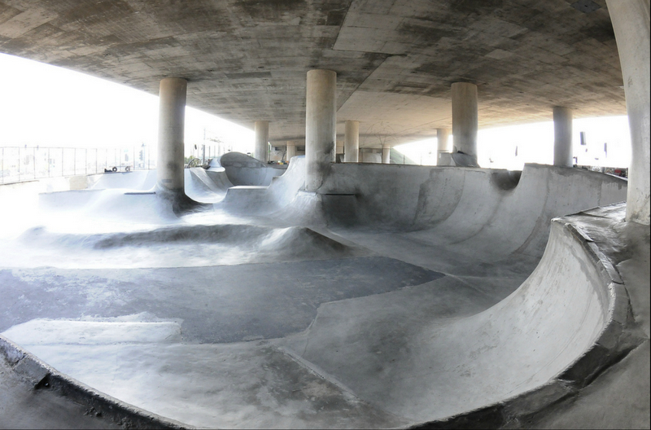
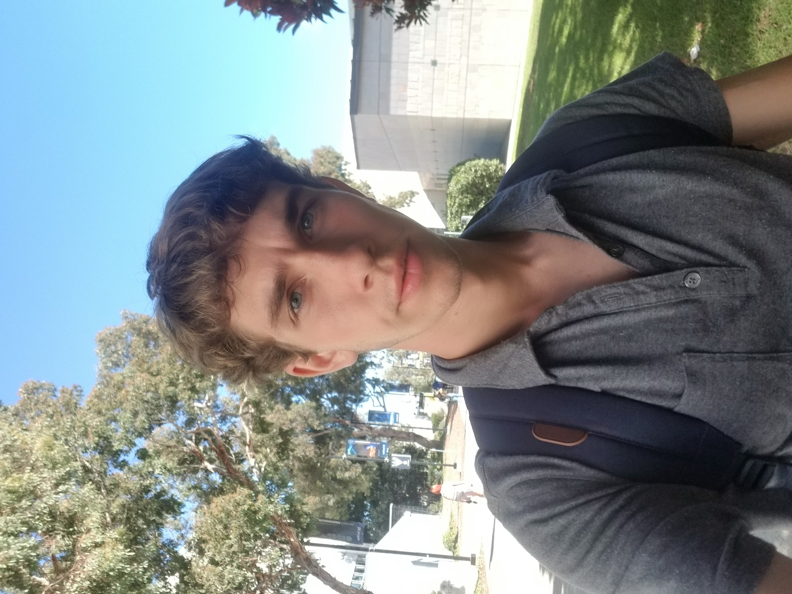

# Part 3. Using Markdown

### Contents
1. [Who am I as a programmer?](#about-me)
<br>
2. [What are my interests outside of programming?](#my-interests)
<br>
3. [What am I looking to accomplish with software engineering?](#why-im-here)

<br>


## About Me
```>>> Hello World```
<br>
I am a 3rd-year transfer (5 years undergrad) at UCSD majoring in Computer Science. You doubtless are wondering what's been taking me so long to finish this ~~impossible~~ trivial (im kidding) major and the answer is simple: rather than speed through my undergrad classes here I've decided to soak up all that USCD has to offer and enjoy my stay here *why not? :)*
This is my second class with professor Powell (the first being CSE 134B) and so far I've coded in the following programming languages:
* [Java](https://www.java.com/en/download/)
* Python
*  C++
*  C
*  Assembly (MIPS & ARM)
*  [Javascript](https://developer.mozilla.org/en-US/docs/Web/javascript)
*  [Espressoscript](clarification.md)
*  [CSS](https://www.youtube.com/watch?v=dQw4w9WgXcQ)
*  HTML.

<br>

## My Interests



I am a sound ~~geek~~ *enthusiast* and very interested in speaker design, digital audio signal processing and sound installations. I am also a passionate DJ and an avid member of the DJ communty on campus. In addition to my passion for noise I also enjoy calisthenics, swimming, and skateboarding. I love standup comedy and podcasting as well as conducting interviews and deep conversations about anything *try me :)*

<br>

## Why I'm Here



A wise man (who coincidentally is the professor for this class) once told me that there is really no functional difference between the operating system which I am using to type up this document and my Chrome browser. 
>There really isn't much of a difference between
>your operating system and the Chrome browser. In fact look at the Chromebook, the web browser IS the operating system!

 My conclusion (whether correct or not) after dwelling on these words for an entire summer is that I won't be escaping the web any time soon. **I might as well learn to ~~love~~ live with it...** and it seems that developing software engineering skills in CSE 110 isn't a bad place to start.

 ```> End Transmission```

[top of page](#)

<br>

***While you're here...***
<br>
How did you find this page? 

- [x] I sent you here
- [ ] resume/job site
- [ ] Github respository
- [ ] Personal website